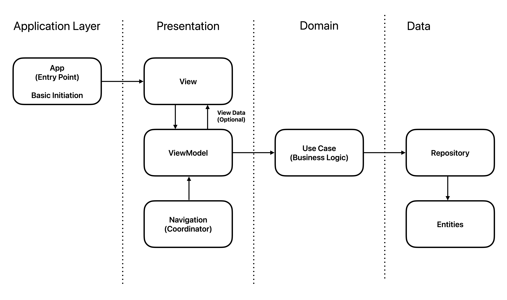

# App Architecture Documentation

## Overview

This document outlines the architecture for a modern application following Clean Architecture principles and MVVM pattern. This architecture is platform-agnostic and can be implemented using any technology stack.

## Architecture Patterns

The application utilizes a combination of **Clean Architecture** and **MVVM (Model-View-ViewModel)** to ensure a scalable, maintainable, and testable codebase.

- **Clean Architecture** separates the codebase into distinct layers (Presentation, Domain, Data), promoting clear boundaries and dependency inversion.
- **MVVM** is used within the Presentation layer to separate UI logic from business logic, improving testability and code clarity.



## Layer Overview

### Presentation Layer

Handles UI rendering, user interaction, navigation, and state display.  
[More details…](Documentation/LAYER_RESPONSIBILITIES.md#presentation-layer)

### Application Layer (optional)

Coordinates workflows, transactions, and integration between multiple use cases or external systems.  
[More details…](Documentation/LAYER_RESPONSIBILITIES.md#application-layer-optional)

### Domain Layer

Contains core business logic, rules, and validation.  
[More details…](Documentation/LAYER_RESPONSIBILITIES.md#domain-layer)

### Data Layer

Implements data access, persistence, and integration with external systems.  
[More details…](Documentation/LAYER_RESPONSIBILITIES.md#data-layer)

> **See also:** [Anti-Patterns](Patterns/ANTI_PATTERNS.md)

## Quick Start - Folder Structure

```text
Sources/
├── Application/
│   ├── MainApp.swift                 // @main, AppDelegate/SceneDelegate (если UIKit)
│   ├── Configuration/                // Flags, environments
│   └── Navigation/                   // Centralized navigation framework
│
├── Domain/
│   ├── Entities/                    // Business models
│   ├── UseCases/                    // LoginUseCase, FetchProfileUseCase
│   ├── Errors/                      // Domain-specific errors
│   └── Repositories/                // Protocols (UserRepository)
│
├── Data/
│   ├── Repositories/                // Impl of UserRepository
│   ├── DTOs/                        // Codable DTOs
│   └── Mappers/                     // DTO ↔ Entity
│
├── Presentation/
│   ├── Features/
│   │   └── Login/
│   │       ├── View/                // LoginView.swift
│   │       ├── ViewModel/           // LoginViewModel.swift + LoginViewModelFactory.swift
│   │       ├── State/               // LoginState.swift (Optional)
│   │       ├── Intent/              // LoginIntent.swift (Optional)
│   │       └── Models/              // LoginViewData.swift (Optional)
│   └── Shared/
│       └── Components/              // Reusable views (e.g. PrimaryButton)
│
├── Resources/
│   ├── Assets.xcassets/
│   └── Info.plist
│
└── Tests/
    ├── DomainTests/
    │   └── LoginUseCaseTests.swift
    ├── DataTests/
    │   └── UserRepositoryImplTests.swift
    ├── PresentationTests/
    │   └── LoginViewModelTests.swift
    └── IntegrationTests/
        └── LoginFlowTests.swift
```

Full folder structure and detailed explanation: [FOLDER_STRUCTURE.md](Documentation/FOLDER_STRUCTURE.md)

## Core Components and Their Purpose

### Presentation Layer

- **View**: Screen representing a full user interface page
  - Example: LoginScreen, TaskListScreen, ProfileScreen
  - Handles user input and display
  - Manages view lifecycle
  - Implements accessibility features

- **Component**: Reusable UI element that is not a full screen
  - Example: Button, Card, InputField, TaskItem
  - Follows composition pattern
  - Supports customization
  - Implements proper error states

- **ViewModel**: Class that manages view state and business logic
  - Example: TaskListViewModel manages the list of tasks and user actions
  - Handles data transformation
  - Manages loading states
  - Implements error handling
  
- **Modifier**: Custom UI modifier for shared styling or behavior
  - Example: PrimaryButtonStyle, CardShadow, ErrorTextStyle
  - Promotes consistency
  - Supports theming
  - Handles responsive design

### Domain Layer

- **Entity**: Plain data structures representing core business concepts
  - Example: User, Task, Order, Product
  - Contains validation logic
  - Implements business rules
  - Supports serialization
- **UseCase**: Class encapsulating a single, specific business action or flow
  - Example: CreateUserUseCase, ProcessOrderUseCase
  - Implements transaction boundaries
  - Handles error cases
  - Manages side effects
- **Repository Protocol**: Defines the contract for data operations
  - Example: UserRepository, OrderRepository
  - Supports CRUD operations
  - Defines query methods
  - Handles pagination
- **Domain Error**: Custom error types for business rule violations
  - Example: InvalidEmailError, InsufficientFundsError
  - Supports error codes
  - Includes error messages
  - Enables error handling
- **Domain Service**: Complex domain logic spanning multiple UseCases
  - Example: PaymentProcessingService, NotificationService
  - Implements cross-cutting concerns
  - Manages complex workflows
  - Handles external integrations

### Data Layer

- **Repository**: Abstracts data access operations
  - Example: UserRepositoryImpl, OrderRepositoryImpl
  - Implements caching
  - Handles data synchronization
  - Manages transactions
- **DataSource**: Concrete implementation for specific data sources
  - Example: RESTAPIClient, LocalDatabase, FileStorage
  - Implements retry logic
  - Handles authentication
  - Manages connection state
- **Service**: Functionality for external system interaction
  - Example: PaymentGatewayService, EmailService
  - Implements API clients
  - Handles authentication
  - Manages rate limiting
- **Worker**: Specific asynchronous tasks
  - Example: BackgroundSyncWorker, ImageProcessingWorker
  - Implements job queues
  - Handles retries
  - Manages resources
- **Mapper**: Data transformation between layers
  - Example: UserDTOtoEntityMapper, OrderEntityToDTOMapper
  - Handles data conversion
  - Implements validation
  - Manages null cases

### Application Layer (optional)

- **Application Service:** Coordinates use case execution, manages transactions, workflows
- **Command Handler:** Handles commands, initiates domain actions
- **Query Handler:** Handles data read requests
- **Event Handler:** Reacts to domain or integration events
- **DTO/Mapper:** Transforms data between layers

## Library and Tool Selection

For recommendations on choosing libraries and tools, see [LIBRARY_GUIDELINES.md](LIBRARY_GUIDELINES.md). These are suggestions, not exhaustive or mandatory instructions.

## Dependency Injection

For detailed dependency injection guidelines, see [Documentation/DEPENDENCY_INJECTION.md](Documentation/DEPENDENCY_INJECTION.md)

## Key Software Design Principles

### SOLID

- **Single Responsibility Principle (SRP):** Each type has one responsibility
- **Open/Closed Principle (OCP):** Code is open for extension but closed for modification
- **Liskov Substitution Principle (LSP):** Subtypes are substitutable for base types
- **Interface Segregation Principle (ISP):** Small, specific interfaces over large ones
- **Dependency Inversion Principle (DIP):** High-level modules depend on abstractions

> For detailed explanations and examples, see [SOLID_PRINCIPLES.md](Patterns/SOLID_PRINCIPLES.md).

### Other Principles

- **DRY (Don't Repeat Yourself):** Avoid code duplication
- **KISS (Keep It Simple, Stupid):** Favor simple solutions
- **YAGNI (You Aren't Gonna Need It):** Implement only necessary functionality
- **Separation of Concerns (SoC):** Divide application into distinct sections
- **Composition Over Inheritance:** Prefer composition for flexibility
- **Law of Demeter:** Modules should know little about other modules
- **Fail Fast:** Detect and report errors early
- **Principle of Least Astonishment:** Code should behave predictably

### Error Handling

For comprehensive error handling guidelines, including error types, propagation strategies, and recovery mechanisms across all layers, see [Documentation/ERROR_HANDLING.md](Documentation/ERROR_HANDLING.md).

## Optional Advanced Patterns

In most mobile and cross-platform applications, classic Clean Architecture and MVVM are sufficient. However, for enterprise-scale, highly complex, or highly integrated systems, you may consider advanced patterns at the Application and Domain layers.

> **For details on optional advanced patterns (CQRS, Event Sourcing, Saga, etc.), see [ADVANCED_PATTERNS.md](Patterns/ADVANCED_PATTERNS.md).**

These are advanced, optional recommendations for complex or enterprise projects only.

## FAQ (Common Questions)

**Q: When should I use the Application Layer?**
A: Use it when you need to coordinate multiple use cases, workflows, or integrations. For simple CRUD apps, it can be omitted.

**Q: How do I test the Domain Layer?**
A: Write unit tests for all use cases, entities, and business rules. Avoid dependencies on frameworks or infrastructure.

**Q: How do I add new features without breaking the architecture?**
A: Add new use cases, entities, or services in the appropriate layer. Do not mix responsibilities between layers. Follow SOLID and DRY principles.

**Q: What if business logic leaks into Presentation or Data Layer?**
A: Refactor the logic into the Domain Layer. Presentation should only handle UI and user interaction; Data should only handle persistence and mapping.

**Q: How do I introduce new patterns (e.g., CQRS, Sagas)?**
A: Only introduce advanced patterns if justified by business complexity. Start with the basics, then refactor as needed. Document all major architectural decisions.

> **See also:** [Architecture Decision Records (ADR)](Documentation/ADR.md) for important architectural decisions and their rationale.
