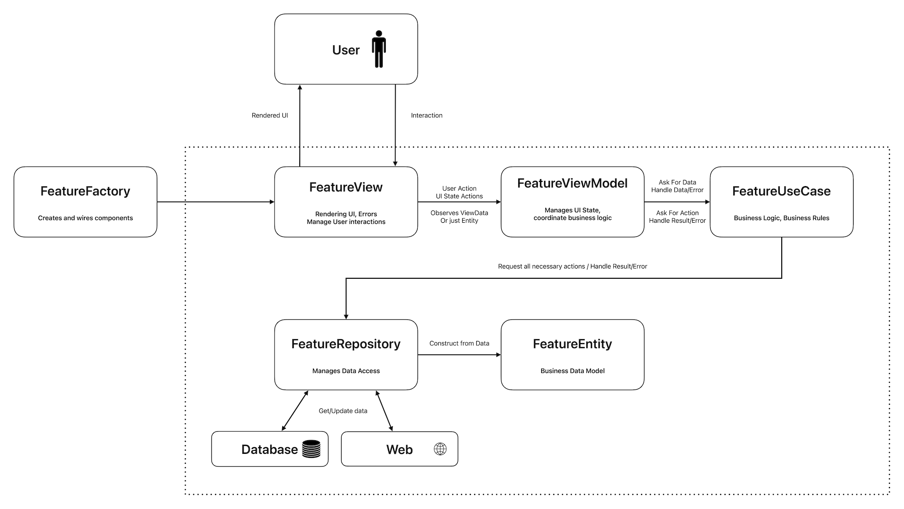

# QuickStart: Minimal Architecture Template



## Quick Overview

This template shows a clean, layered architecture for iOS apps. Each layer has a specific job:

- **Entity**: Your data model (like a database table)
- **Repository**: Gets data from anywhere (API, database, etc.)
- **UseCase**: Contains business rules and logic
- **ViewModel**: Prepares data for the screen
- **ViewData**: Data formatted for the screen
- **View**: The actual screen you see
- **Factory**: Connects all pieces together

Think of it like building a house:

- Entity is your raw materials
- Repository is your supplier
- UseCase is your building plan
- ViewModel is your contractor
- ViewData is your furniture layout
- View is your finished house
- Factory is your construction manager

## Why Use This?

- Makes business logic testable and UI-independent
- Keeps UI reactive and simple
- Scales well for small and large apps

## Add Your Feature

To create a new screen:

1. Duplicate `FeatureEntity`, `FeatureRepository`, etc. with your names.
2. Replace logic inside.
3. Add new case to `FactoryType` and switch logic.

## Implementation

### Entity

```swift
final class FeatureEntity: Codable, Identifiable {
  var id: String
  var name: String
  var description: String?

  init(name: String, description: String? = nil) {
    self.id = UUID().uuidString
    self.name = name
    self.description = description
  }
}
```

*Holds business data, no UI logic.*

---

### Repository

```swift
protocol FeatureRepository {
  func getFeatureData() -> FeatureEntity
}

final class FeatureRepositoryImpl: FeatureRepository {
  func getFeatureData() -> FeatureEntity {
    FeatureEntity(
      name: "Feature Name",
      description: "Feature Description \(Date())"
    )
  }
}
```

*Data source abstraction.*

---

### UseCase

```swift
protocol FeatureGetUseCase {
  func getEntity() -> FeatureEntity
}

final class FeatureGetUseCaseImpl: FeatureGetUseCase {
  private let repository: FeatureRepository

  init(repository: FeatureRepository) {
    self.repository = repository
  }

  func getEntity() -> FeatureEntity { repository.getFeatureData() }
}
```

*Business logic for data retrieval.*

---

### ViewModel

```swift
@Observable
final class FeatureViewModelImpl: FeatureViewModel {
  private let useCase: FeatureGetUseCase

  private var entity: FeatureEntity? {
    didSet { updateViewData() }
  }

  private(set) var viewData: FeatureViewData?

  init(useCase: FeatureGetUseCase) {
    self.useCase = useCase
    Task { updateEntity() }
  }

  func updateEntity() {
    self.entity = useCase.getEntity()
  }

  private func updateViewData() {
    viewData = entity.map { FeatureViewData(entity: $0) }
  }
}
```

*Handles reactive state and adapts data for UI.*
> This architecture uses `@Observable` and `@Bindable` for state-driven UI updates.

---

### ViewData

```swift
struct FeatureViewData {
  var name: String
  var description: String?

  init(entity: FeatureEntity) {
    self.name = entity.name
    self.description = entity.description
  }
}
```

*Data model for UI.*

---

### View

```swift
struct FeatureView<ViewModel: FeatureViewModel>: View {
  @Bindable var model: ViewModel

  var body: some View {
    VStack {
      Text("Feature View")

      if let data = model.viewData {
        Text("Name: \(data.name)")
        if let desc = data.description {
          Text("Description: \(desc)")
        }
      }

      Button("Update") {
        model.updateEntity()
      }
    }
  }
}
```

*Subscribes to ViewModel and displays data.*

---

### Factory

```swift
struct FeatureViewFactory: Hashable {
  var type: FactoryType

  func view() -> AnyView {
    switch type {
    case .impl: AnyView(impl())
    }
  }

  @ViewBuilder
  private func impl() -> some View {
    let repository = FeatureRepositoryImpl()
    let useCase = FeatureGetUseCaseImpl(repository: repository)
    let viewModel = FeatureViewModelImpl(useCase: useCase)
    FeatureView(model: viewModel)
  }

  enum FactoryType { case impl }
}
```

*Creates and links components.*

## Common Pitfalls

1. **Architecture Violations**
   - ❌ Don't put business logic in ViewModels
   - ❌ Don't access repositories directly from Views
   - ❌ Don't skip the UseCase layer for "simple" features

2. **State Management**
   - ❌ Don't use global state
   - ❌ Don't mix different state management approaches
   - ❌ Don't forget to handle loading and error states

3. **Testing**
   - ❌ Don't skip unit tests for business logic
   - ❌ Don't test implementation details
   - ❌ Don't create complex test setups

## Next Steps

1. **Learn More**
   - [Architecture Overview](../../Documentation/ARCHITECTURE.md)
   - [Layer Responsibilities](../../Documentation/LAYER_RESPONSIBILITIES.md)
   - [Unit Testing Guidelines](../../UNIT_TESTING.md)

2. **Best Practices**
   - [SOLID Principles](../../Patterns/SOLID_PRINCIPLES.md)
   - [Anti-Patterns](../../Patterns/ANTI_PATTERNS.md)
   - [Advanced Patterns](../../Patterns/ADVANCED_PATTERNS.md)

3. **Tools & Automation**
   - [CI/CD Setup](../../CICD.md)
   - [Dependency Injection](../../Documentation/DEPENDENCY_INJECTION.md)
   - [Project Structure](../../Documentation/FOLDER_STRUCTURE.md)
